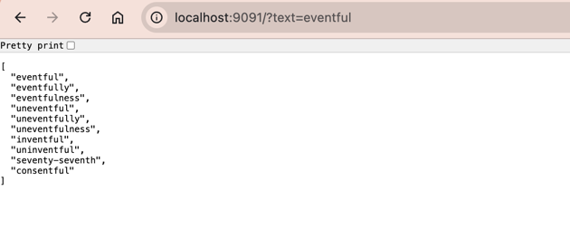

# Result


Here we can see that most words are having less or equal 3 errors.
It was done by analyzing three grams tokens
``` json
[
  "eventful",
  "eventfully",
  "eventfulness",
  "uneventful",
  "uneventfully",
  "uneventfulness",
  "inventful",
  "uninventful",
  "seventy-seventh",
  "consentful"
]
```
